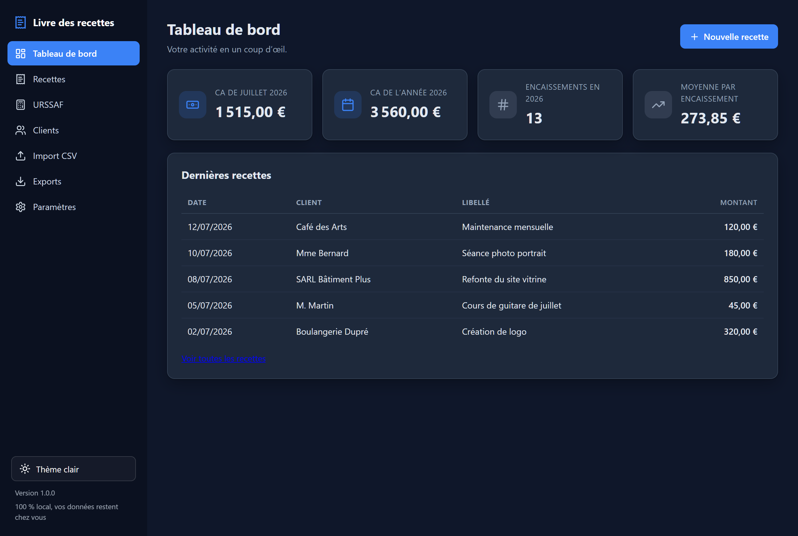
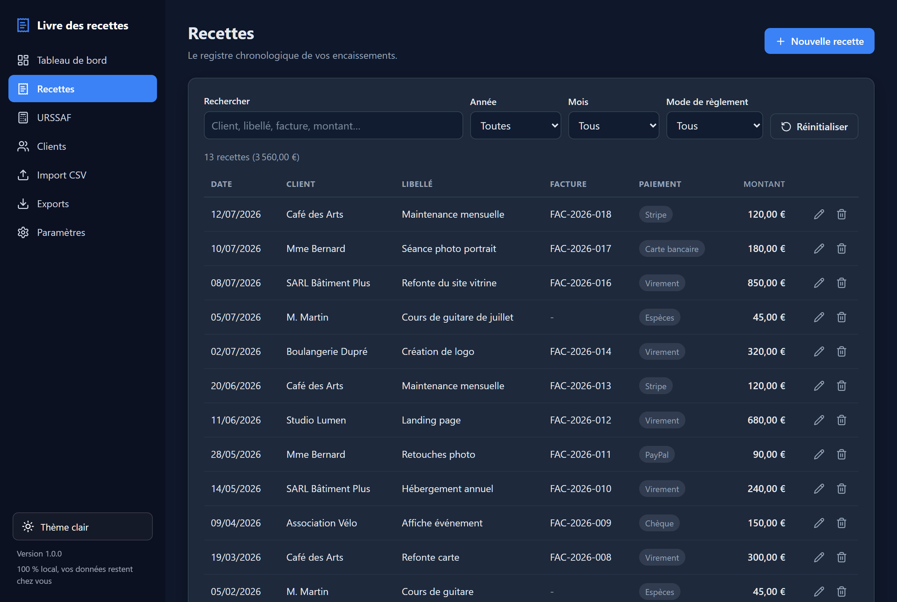

# Livre des recettes

> Le livre des recettes des micro-entrepreneurs français, sans tableur et sans prise de tête :
> une application **100 % locale**, ultra légère, qui fait une seule chose et la fait bien.


En tant que micro-entrepreneur, vous devez tenir un **livre des recettes** : le registre
chronologique de tous vos encaissements, présentable en cas de contrôle. Beaucoup le
tiennent dans Excel ; cette application fait la même chose, en plus simple et plus sûr :
saisie guidée, totaux automatiques, exports conformes, et vos données restent chez vous.

**Ce que ce projet n'est pas** : un logiciel de comptabilité, de facturation ou de
télédéclaration.

## Aperçu





## Fonctionnalités

- **Saisie des recettes** limitée aux six colonnes du registre légal : date d'encaissement,
  client, libellé, numéro de facture, montant et mode de règlement (CB, virement, espèces,
  chèque, PayPal, Stripe, autre). Ajout, modification, suppression.
- **Carnet de clients** : créez vos clients une fois, puis choisissez-les à la saisie d'une
  recette pour éviter les fautes de frappe. Un client peut être retrouvé automatiquement par
  son **SIRET** grâce à l'annuaire public des entreprises (le nom exact est récupéré pour vous).
- **Tableau principal** : tri par date décroissante, recherche libre insensible aux accents
  (client, libellé, facture, montant), filtres par année, mois et mode de règlement.
- **Tableau de bord** : CA du mois, CA de l'année, nombre d'encaissements, moyenne
  par encaissement, dernières recettes.
- **Déclaration URSSAF** : choisissez une année puis un mois, un trimestre ou l'année entière,
  l'application calcule le chiffre d'affaires encaissé et le nombre d'encaissements de la période.
  _Aucune connexion à l'URSSAF : c'est un simple calcul local._
- **Exports conformes** en **PDF**, **Excel (.xlsx)** et **CSV**, avec les colonnes du
  registre légal et les **totaux mensuels et annuel** ajoutés automatiquement.
- **Import CSV** : reprenez votre historique Excel avec correspondance des colonnes
  assistée, détection des doublons et rapport d'analyse avant tout import.
- **Paramètres** : nom de l'entreprise, SIREN, SIRET, adresse, activité, devise,
  format de date (repris en tête des exports).

## Installation

**Prérequis** : [Node.js](https://nodejs.org) 18 ou plus récent (LTS recommandée).
C'est tout : aucune base de données, aucun compte, aucune compilation.

```bash
git clone https://github.com/RDSV01/livre-des-recettes.git
cd livre-des-recettes
npm install
npm start
```

L'application s'ouvre sur `http://localhost:3000` (uniquement accessible depuis
votre machine). Sous Windows, un double-clic sur `start.bat` fait tout ; sous
macOS / Linux, `./start.sh`.

> Pas de compte GitHub ? Téléchargez le ZIP du projet (bouton « Code » puis « Download ZIP »),
> décompressez-le, puis lancez `start.bat` (Windows) ou `./start.sh`.

## Vos données : rien ne se perd

C'est l'engagement central du projet :

- **Tout tient dans un seul fichier** lisible : `data/livre-des-recettes.json` (recettes,
  clients et paramètres). Pas de base de données cachée, pas de stockage dans le navigateur :
  vous pouvez changer de navigateur (Firefox, Chrome, Edge…) sans rien perdre.
- **Sauvegarde quotidienne automatique** dans `data/sauvegardes/` (30 jours glissants),
  et écriture « atomique » : une coupure de courant ne corrompt jamais le fichier.
- **Changer d'ordinateur** = copier le dossier `data/` sur le nouveau poste. C'est tout.
- **Dossier synchronisé** (Nextcloud, Drive, Dropbox…) : lancez l'application avec
  `LDR_DATA_DIR` pointant vers votre dossier synchronisé, et vos données vous suivent :

  ```bash
  LDR_DATA_DIR="D:/MonDrive/livre-recettes" npm start
  ```

- **Copie manuelle à tout moment** : Paramètres puis « Télécharger une copie de mes
  données (JSON) ». Pour restaurer, remplacez `data/livre-des-recettes.json` par
  cette copie.

## Vie privée et connexion Internet

L'application fonctionne intégralement hors ligne. **Un seul** point contacte l'extérieur,
et seulement quand vous le déclenchez vous-même : la **recherche d'un client par SIRET**,
qui interroge l'API publique et gratuite [recherche-entreprises.api.gouv.fr](https://recherche-entreprises.api.gouv.fr)
pour récupérer le nom exact de l'entreprise. Aucune clé, aucun compte, et vous pouvez
toujours saisir le nom d'un client manuellement sans jamais utiliser cette recherche.

## Configuration

| Variable d'environnement | Rôle                                               | Défaut   |
| ------------------------ | -------------------------------------------------- | -------- |
| `PORT`                   | Port d'écoute local                                | `3000`   |
| `LDR_DATA_DIR`           | Dossier des données                                | `./data` |
| `LDR_NO_OPEN`            | Si définie, n'ouvre pas le navigateur au démarrage | (aucun)  |

## Cadre légal (en bref)

Les micro-entrepreneurs doivent tenir un livre des recettes présentant, dans l'ordre
chronologique des encaissements : le montant et l'origine des recettes (client), le mode
de règlement et les références des pièces justificatives (factures). Les exports de
l'application suivent ces colonnes. Conservez vos livres et justificatifs pendant 10 ans.

> Cet outil vous aide à **tenir** votre livre des recettes ; il ne constitue ni un
> conseil comptable ou juridique, ni un logiciel de caisse certifié. En cas de doute
> sur vos obligations, rapprochez-vous de l'URSSAF ou d'un expert-comptable.

## Développement

Stack volontairement minimale : **Node.js + Express** côté serveur, **HTML / CSS / JS
vanilla** côté navigateur (aucun framework, aucune étape de build), données en JSON.
Trois dépendances : `express`, `exceljs`, `pdfkit`.

```text
server.js              Point d'entrée (npm start)
src/
  app.js               Assemblage Express
  stockage.js          Persistance JSON (écriture atomique + sauvegardes)
  validation.js        Validation des recettes, clients et paramètres
  totaux.js            Calculs (totaux, tableau de bord, bilan URSSAF)
  entreprises.js       Recherche d'entreprise par SIRET (API publique)
  partage/             Modules communs serveur + navigateur (servis sous /partage)
  routes/              API REST (recettes, clients, exports, urssaf, parametres)
  exports/             Générateurs PDF, Excel, CSV du registre
public/                Interface (index.html, css, js/vues, icônes)
tests/                 Tests node:test (npm test)
```

```bash
npm test   # 59 tests : unités + API en conditions réelles
```

## Crédits

Icônes : [Lucide](https://lucide.dev), sous licence ISC, dont les tracés sont intégrés
directement dans `public/js/icones.js` (aucune ressource chargée depuis Internet).

## Contribuer

Les contributions sont bienvenues, dans le périmètre du projet : lisez
[CONTRIBUTING.md](CONTRIBUTING.md) avant d'ouvrir une issue ou une pull request.

## Roadmap

Les évolutions envisagées sont dans
[ROADMAP.md](ROADMAP.md).

## Licence

[MIT](LICENSE) : utilisez, copiez, modifiez librement.
