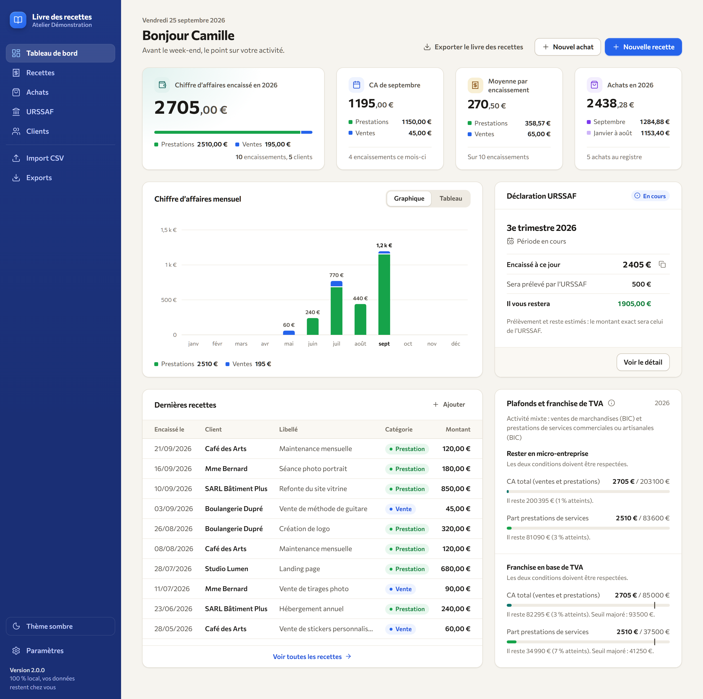
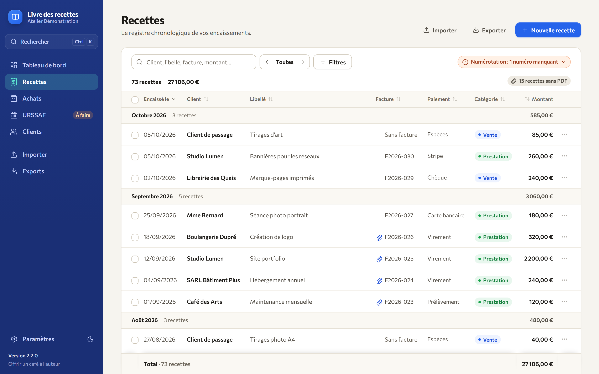
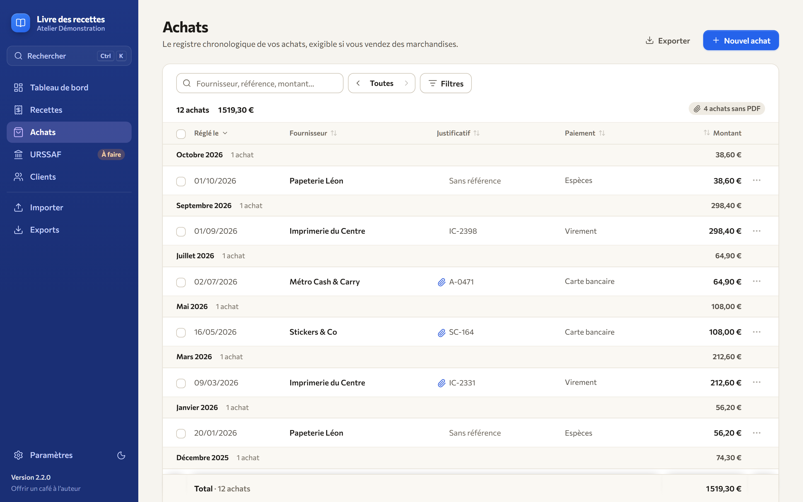

# Livre des recettes

> Le livre des recettes des micro-entrepreneurs français, sans tableur et sans prise de tête :
> une application **100 % locale**, légère, qui fait une seule chose et la fait bien.


**[Télécharger l'application](https://github.com/RDSV01/livre-des-recettes/releases/latest)**

En tant que micro-entrepreneur, vous devez tenir un livre des recettes : le registre
chronologique de vos encaissements, à présenter en cas de contrôle. Beaucoup le tiennent
dans Excel. Cette application fait la même chose, plus simplement et plus sûrement : saisie
guidée, totaux automatiques, exports conformes, et vos données restent sur votre ordinateur.
Si vous vendez des marchandises, elle tient aussi le registre des achats, le second registre
exigible.

Ce n'est ni un logiciel de comptabilité, ni de facturation, ni de télédéclaration.

## Aperçu







## Fonctionnalités

### Le livre des recettes

- **Saisie des recettes** : les six colonnes du registre légal (date d'encaissement, client,
  libellé, numéro de facture, montant, mode de règlement), en ajout, modification ou
  suppression. Modes proposés : CB, virement, espèces, chèque, PayPal, Stripe, autre, et vos
  propres modes.
- **Saisie assistée**, dans un panneau latéral qui laisse la liste visible : le client se
  retrouve en quelques lettres ou par son SIRET (annuaire des entreprises), et les libellés
  déjà facturés à ce client passent en premier avec leur montant et leur catégorie.
  L'application suggère aussi le prochain numéro de facture, duplique une recette en un clic
  pour les paiements récurrents, et prévient, sans bloquer, si une recette très proche existe
  déjà.
- **Factures en PDF** : déposez la facture dans le panneau de saisie ou directement sur sa
  ligne. Le trombone l'ouvre dans un aperçu (télécharger, remplacer, retirer), et un filtre
  retrouve les recettes sans PDF.
- **Carnet de clients** : créez un client une fois, puis choisissez-le à la saisie, sans faute
  de frappe. Pour un professionnel, le SIREN ou le SIRET suffit : le nom exact vient de
  l'annuaire public des entreprises. Pour un particulier, un nom suffit. Le carnet affiche,
  pour chaque client, le nombre de recettes, le chiffre d'affaires et sa part du total ; il
  se trie par chiffre d'affaires, par nom ou par dernier encaissement. La fiche d'un client
  reprend ses encaissements et ses factures jointes.
- **Tableau principal** : lecture mois par mois avec sous-totaux, tri par colonne, sélection
  multiple (suppression ou reclassement groupés), recherche surlignée (client, libellé,
  facture, montant), année choisie d'une flèche, filtres par mois, mode de règlement,
  catégorie et pièce jointe. Titres et total restent visibles pendant le défilement. Chaque
  geste répond sur place : « Ajoutée · Annuler » sur la ligne ajoutée, « Supprimée ·
  Annuler » à la place d'une ligne supprimée, et Ctrl+Z / Ctrl+Y au clavier.
- **Numérotation des factures surveillée** : doublons et numéros manquants sont signalés,
  quelle que soit votre convention (« F001 », « FAC2026-001 », « A-2026-0007 »…), sans
  jamais rien bloquer.

### Le registre des achats

- **Saisie des achats** : les cinq colonnes du registre légal, dans l'ordre des règlements
  (date, fournisseur, référence de la facture ou du justificatif, mode de paiement,
  montant). Ce registre est obligatoire pour l'achat-revente de marchandises.
- **Mêmes automatismes que les recettes** : fournisseurs déjà saisis proposés, duplication
  d'un achat récurrent, justificatif en PDF, tri, recherche (fournisseur, référence,
  montant), filtres par année, mois, mode de paiement et pièce jointe.
- **Import CSV et exports** (PDF, Excel, CSV, avec totaux mensuels et annuel), comme pour le
  livre des recettes.

### Pilotage

- **Tableau de bord** : une salutation selon le moment de la journée (avec votre prénom si
  vous l'avez donné), le chiffre d'affaires de l'année et du mois, la moyenne par
  encaissement, le total des achats de l'année, le graphique du chiffre d'affaires mensuel
  (total sur chaque colonne, ou en tableau), la déclaration URSSAF à faire avec son montant,
  et les dernières recettes. Les années précédentes restent consultables.
- **Accueil guidé** : au premier lancement, quelques questions (prénom, entreprise retrouvée
  par son SIRET, activité, rythme de déclaration), et le livre est prêt. Rien n'est
  obligatoire ; interrompu, l'accueil reprend au lancement suivant.
- **Jeu de démonstration** : un livre fictif à charger d'un clic dès l'accueil, effaçable
  d'un clic, jamais mêlé à vos vraies données.
- **Suivi des seuils** : selon votre activité (achat-revente, prestations commerciales ou
  artisanales, activité libérale, ou mixte), le tableau de bord suit votre progression vers
  le plafond micro-entrepreneur et le seuil de franchise en base de TVA : montant restant,
  pourcentage atteint, alerte à l'approche.
- **Activité mixte** : chaque recette est classée vente ou prestation, et la distinction suit
  partout : colonne Catégorie, chiffre d'affaires du mois et de l'année par activité,
  graphique mensuel, suivi de la part prestations (qui a ses propres plafonds), bilan URSSAF
  ventilé comme la déclaration, exports avec colonne Catégorie et sous-totaux « dont
  ventes / dont prestations ».
- **Déclaration URSSAF** : les mois ou les trimestres de l'année en onglets, selon votre
  rythme, chacun avec son état (déclarée, en cours, à déclarer, en retard). Pour la période
  choisie, l'application donne le chiffre d'affaires à déclarer et la date limite, puis
  estime ce que l'URSSAF prélèvera (cotisations sociales, formation professionnelle et, si
  vous l'avez choisi, versement libératoire) et ce qu'il vous restera. En activité mixte,
  chaque part est calculée à son taux, selon la nature de prestations indiquée dans les
  paramètres. Avec l'ACRE (option et date de début d'activité dans les paramètres), les
  cotisations sociales passent au taux réduit jusqu'à la fin du 3e trimestre civil qui suit.
  Le tableau de bord et le menu signalent la déclaration à faire ; « C'est fait » la marque
  déclarée, et reste annulable.
  _Aucune connexion à l'URSSAF : c'est un calcul local._

### Échanges et sécurité des données

- **Exports conformes** des deux registres en PDF, Excel (.xlsx) et CSV, avec les colonnes
  légales et les totaux mensuels et annuel. En option, une archive .zip y ajoute les PDF
  joints de la période (factures ou justificatifs), prête pour un comptable ou un contrôle.
- **Vérification avant export** : avant chaque téléchargement, l'application passe en revue
  ce qu'un contrôleur regarderait (mentions obligatoires, continuité de la numérotation,
  doublons). Elle informe, sans jamais bloquer.
- **Rapport annuel de gestion** en PDF, pour vous et non pour l'administration : chiffre
  d'affaires et répartition, panier moyen, évolution mensuelle en graphique, moyens de
  paiement, clients de l'année et meilleurs d'entre eux, comparaison avec l'année
  précédente, puis le détail de chaque encaissement.
- **Import CSV** des recettes et des achats : glissez votre historique Excel, associez les
  colonnes avec l'aide de l'application, repérez les doublons, lisez le rapport d'analyse
  avant tout import. Une sauvegarde automatique est faite juste avant, pour pouvoir revenir
  en arrière.
- **Sauvegardes** : les sauvegardes automatiques (copie de secours, quotidiennes, avant
  import, avant restauration) sont listées dans les paramètres et se restaurent en un clic.
  Au démarrage, l'application vérifie le fichier de données. S'il est illisible, elle propose
  de restaurer la dernière sauvegarde valide sans rien écraser ; s'il a disparu, de le
  reconstituer ou de repartir d'un livre vide.
- **Paramètres** : prénom, identité de l'entreprise (en tête des exports), type d'activité,
  périodicité de déclaration, devise, format de date, modes de règlement personnalisés, et
  une option pour chaque aide à la saisie.

## Installation

### Le plus simple : l'exécutable

Téléchargez l'exécutable de votre système sur la
[page des versions](https://github.com/RDSV01/livre-des-recettes/releases) et lancez-le :
l'application s'ouvre dans votre navigateur, sans installer Node.js. Vos données sont
rangées dans Documents / Livre des recettes.

Le fichier n'est pas signé (le certificat est payant) : Windows ou macOS peut afficher un
avertissement au premier lancement. Cliquez sur « Informations complémentaires » puis
« Exécuter quand même », ou, sur Mac, faites un clic droit puis « Ouvrir ».

### Depuis les sources

Prérequis : [Node.js](https://nodejs.org) 18 ou plus récent (LTS recommandée). Ni base de
données, ni compte, ni compilation.

```bash
git clone https://github.com/RDSV01/livre-des-recettes.git
cd livre-des-recettes
npm install
npm start
```

L'application s'ouvre sur `http://localhost:3000`, accessible uniquement depuis votre
machine.

## Vos données : rien ne se perd

- **Un seul fichier lisible** : `Documents/Livre des recettes/livre-des-recettes.json`
  (recettes, achats, clients et paramètres). Ni base cachée ni stockage dans le navigateur :
  vous pouvez changer de navigateur (Firefox, Chrome, Edge…) sans rien perdre. Les
  paramètres affichent le chemin exact. Les PDF joints sont rangés à côté, dans le dossier
  `pieces`, et doublés dans le dossier des sauvegardes ; un PDF n'est effacé que lorsque ni
  le livre ni aucune sauvegarde ne le cite.
- **Des sauvegardes automatiques rangées ailleurs**, dans le dossier applicatif du système :
  une par jour gardée 14 jours, puis une par semaine pendant 2 mois, puis une par mois
  pendant 1 an, plus une copie de secours mise à jour à chaque saisie. Supprimer le dossier
  de données n'efface donc rien : au démarrage suivant, l'application propose de tout
  reconstituer, jusqu'à la dernière recette saisie. L'écriture est atomique : une coupure de
  courant ne corrompt pas le fichier.
- **Une seule instance à la fois** : un verrou empêche deux lancements (deux fenêtres, ou
  deux ordinateurs sur un dossier synchronisé) de s'écraser l'un l'autre. Un second
  lancement rouvre la fenêtre déjà ouverte.
- **Changer d'ordinateur** : copiez le dossier « Livre des recettes » sur le nouveau poste.
  C'est tout.
- **Dossier synchronisé** (Nextcloud, Drive, Dropbox…) : pointez `LDR_DATA_DIR` vers ce
  dossier (voir Configuration), et vos données vous suivent.
- **Copie manuelle à tout moment** : Paramètres, puis « Télécharger une copie (JSON) » ou
  « Copie complète avec les PDF (.zip) ». Pour restaurer, remplacez
  `livre-des-recettes.json` par cette copie (pour l'archive, décompressez-la dans le
  dossier de données).

## Vie privée et connexion Internet

L'application fonctionne entièrement hors ligne. Deux fonctions seulement contactent
l'extérieur, et aucune n'envoie vos données :

- la recherche d'un client par SIRET, uniquement quand vous la lancez : elle interroge l'API
  publique et gratuite [recherche-entreprises.api.gouv.fr](https://recherche-entreprises.api.gouv.fr)
  pour obtenir le nom exact de l'entreprise, sans clé ni compte. Vous pouvez toujours saisir
  le nom à la main, pour un particulier par exemple ;
- la recherche d'une nouvelle version au démarrage : l'application demande à GitHub le
  numéro de la dernière version publiée, rien d'autre. Décochez l'option dans les paramètres
  et elle ne contacte plus rien. Avant d'installer une mise à jour, elle vérifie le fichier
  téléchargé par son empreinte SHA-256, calculée sur votre machine.

## Configuration

| Variable d'environnement | Rôle                                               | Défaut                         |
| ------------------------ | -------------------------------------------------- | ------------------------------ |
| `PORT`                   | Premier port d'écoute local essayé                 | `3000`                         |
| `LDR_DATA_DIR`           | Dossier des données                                | `Documents/Livre des recettes` |
| `LDR_NO_OPEN`            | Si définie, n'ouvre pas le navigateur au démarrage | (aucun)                        |

## Cadre légal (en bref)

Le livre des recettes présente, dans l'ordre chronologique des encaissements, le montant et
l'origine de chaque recette (client), le mode de règlement et la référence des pièces
justificatives (numéro de facture). Si votre activité comporte de la vente de marchandises,
vous tenez en plus un registre des achats, dans l'ordre chronologique des règlements : date,
fournisseur, référence de la pièce, mode de paiement et montant. Les exports de
l'application suivent ces colonnes. Conservez livres et justificatifs pendant 10 ans.

> Cet outil vous aide à tenir votre livre des recettes. Ce n'est ni un conseil comptable ou
> juridique, ni un logiciel de caisse certifié. En cas de doute sur vos obligations ou sur
> les seuils en vigueur, adressez-vous à l'URSSAF ou à un expert-comptable.

## Développement

Stack minimale : Node.js et Express côté serveur ; HTML, CSS et JavaScript sans framework ni
étape de build côté navigateur ; données en JSON. Trois dépendances : `express`, `exceljs`,
`pdfkit`.

```text
server.js              Point d'entrée (npm start)
src/
  app.js               Assemblage Express
  lancement.js         Démarrage du serveur (verrou, écoute locale, navigateur)
  stockage.js          Persistance JSON (écriture atomique, sauvegardes, intégrité)
  pieces.js            PDF joints aux lignes (rangement, double hors des données, ménage)
  validation.js        Validation des recettes, achats, clients et paramètres
  totaux.js            Calculs (totaux, CA mensuel, tableau de bord, bilan URSSAF)
  import-registre.js   Mécanique d'import en lot commune aux deux registres
  rapport-annuel.js    Agrégats du rapport annuel de gestion (hors registres légaux)
  controle-export.js   Contrôle d'un registre avant export (mentions, doublons)
  cotisations.js       Estimation des prélèvements URSSAF (cotisations sociales, ACRE,
                       formation professionnelle, versement libératoire), au taux en
                       vigueur le jour de chaque encaissement
  demo.js              Jeu de démonstration (données fictives)
  entreprises.js       Recherche d'entreprise par SIREN / SIRET (API publique)
  maj.js               Nouvelle version publiée : détection, empreinte et installation
  emplacements.js      Où ranger les données, et les sauvegardes hors de celles-ci
  verrou.js            Verrou d'instance (un seul lancement à la fois)
  partage/             Modules communs serveur + navigateur (servis sous /partage) :
                       constantes, dates, montants, texte, doublons, seuils, factures,
                       filtres, déclarations, salutations, acre
    bareme-seuils.js   Montants légaux : SEUL fichier à modifier quand la loi change.
                       Seuils annuels (plafonds micro, TVA, abattements), paliers
                       de taux de cotisations bornés au jour près, et fractions ACRE
  routes/              API REST (recettes, achats, clients, exports, urssaf, sauvegardes,
                       parametres, maj), et celles des deux registres : pièces jointes
                       (pieces) et opérations groupées (lots)
  exports/             Générateurs PDF, Excel, CSV des deux registres, rapport annuel,
                       et archive .zip avec les PDF joints (zip.js, sans dépendance)
public/                Interface (index.html, css, polices, js/vues, icônes, historique)
assets/                Icône de l'exécutable Windows
scripts/               Construction de l'exécutable (construire-exe), vérification
                       (verifier) et livre d'essai temporaire (essai)
tests/                 Tests node:test (npm test)
```

```bash
npm run essai         # l'application sur un livre vide et temporaire (accueil guidé compris),
                      # sans toucher au vrai livre ; « npm run essai -- --garder » le conserve
npm test              # unités + API en conditions réelles
npm run verifier      # parcours de bout en bout de l'application assemblée
npm run construire:exe # exécutable autonome dans dist/ (esbuild + Node SEA)
```

Seule la construction de l'exécutable demande des dépendances supplémentaires (`esbuild`,
`postject` et `resedit`), installées en développement uniquement : l'application garde ses
trois dépendances.

## Crédits

Icônes : [Lucide](https://lucide.dev), sous licence ISC, avec des tracés intégrés
directement dans `public/js/icones.js` (rien n'est chargé depuis Internet).

Police : [Commissioner](https://github.com/kosbarts/Commissioner), sous licence SIL Open
Font License 1.1, livrée avec l'application (`public/polices`, licence jointe dans
`OFL.txt`).

## Contribuer

Les contributions sont bienvenues dans le périmètre du projet : lisez
[CONTRIBUTING.md](CONTRIBUTING.md) avant d'ouvrir une issue ou une pull request.

## Roadmap

Ce qui a été fait et ce qui est envisagé : [ROADMAP.md](ROADMAP.md).

## Licence

[MIT](LICENSE) : utilisez, copiez, modifiez librement.
